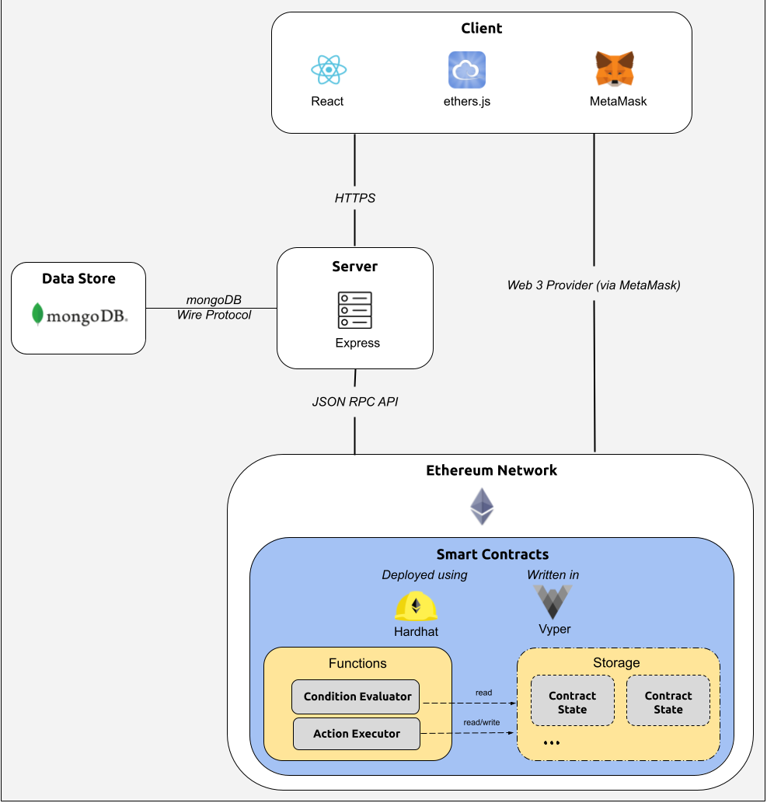

# BlocX-Tech

This is the technical repository for BlocX. The primary Team Repository can be found [here](https://github.com/dcsil/BlocX).

Table of Contents
---
- [High-Level Architecture](#high-level-architecture)

## High-Level Architecture

### Client

The client is primarily based on the React framework.

[Solana Wallet Adaptor](https://github.com/solana-labs/wallet-adapter) is used to handle the connections with third-party crypto wallets (we aim to at least support [Phantom](https://phantom.app)).

The [Anchor framework](https://github.com/project-serum/anchor)'s [TypeScript client library](https://project-serum.github.io/anchor/ts/index.html) is used to generate TypeScript components based on the [IDL](https://en.wikipedia.org/wiki/Interface_description_language) of the main program (written in Rust) on the Solana Network. 

### Solana Network

The Anchor framework is used to generate Rust primitives for the main program.

The main Solana [program](https://docs.solana.com/developing/programming-model/accounts#executable) owns and behaves as an executor for existing active contracts.

Non-executable [accounts](https://docs.solana.com/developing/programming-model/accounts) are created ad hoc to store the current state of active contracts.

### Server

Express server used to serve the static React client.

Also acts as a gateway between the client and the Solana network for requesting read-only information, keeping the client as lightweight as possible.

### Data Store

MongoDB is used to cache server requests.

### Communication

The client communicates directly with the Solana network for write-requests via the [Solana JavaScript API](https://docs.solana.com/developing/clients/javascript-api). Examples include creating new non-executable accounts for new contracts ([ownership](https://docs.solana.com/developing/programming-model/accounts#ownership-and-assignment-to-programs) is immediately transferred to the Contract Executor program), or instructing the Contract Executor to progress an active contract, etc.

For read-requests, the client communicates with the Express server with REST APIs via HTTPS; the Express server in turn queries the Solana network using the Solana JavaScript API.
