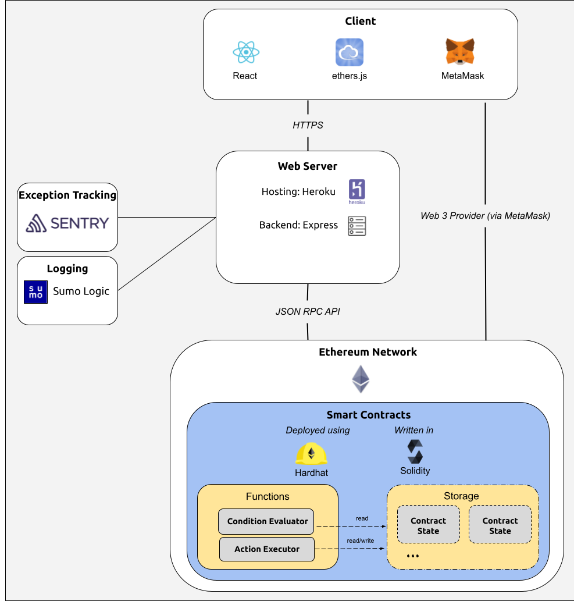
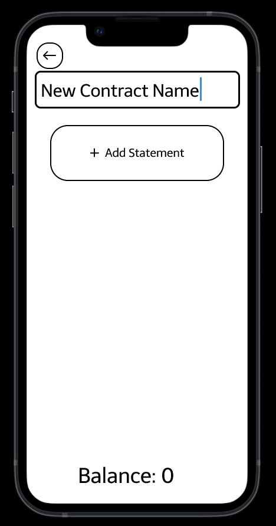
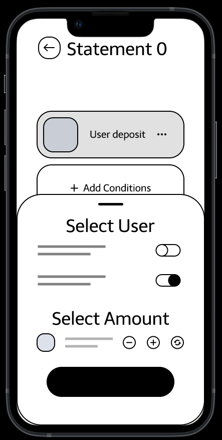
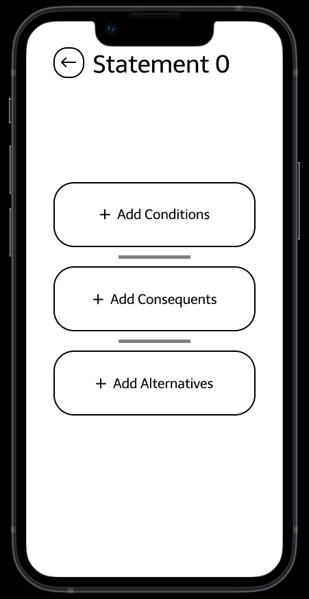
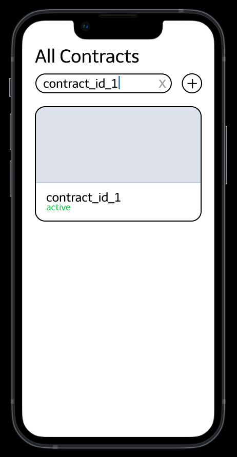
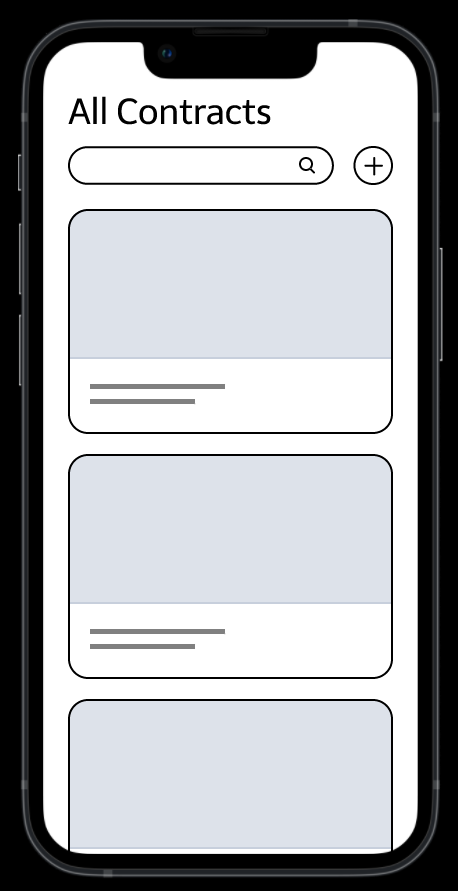

# BlocX-Tech

This is the technical repository for BlocX. The primary Team Repository can be found [here](https://github.com/dcsil/BlocX).

To get started with Development, please check the [Development doc](https://github.com/dcsil/BlocX-Tech/blob/main/docs/development.md).

Table of Contents
---
- [High-Level Architecture](#high-level-architecture)
- [Use Cases](#use-cases)
- [Development](#development)

## High-Level Architecture

### Client

The client is primarily based on the React framework.

[Metamask](https://metamask.io) and [EtherJS](https://docs.ethers.io/v5/) is used to handle the connections with the Ethereum network from the client. For the MVP, we will only support Metamask wallets.

[Hardhat](https://hardhat.org) is used to generate ABI artifacts of the main smart contract (written in Vyper). 

### Ethereum Network

The Hardhat framework is used to develop and deploy smart contracts on the Ethereum Network. Smart contracts are written in Vyper.

### Server

Express server used to serve the static React client.

Also acts as a gateway between the client and the Ethereum network for requesting read-only information, keeping the client as lightweight as possible.

### Data Store

MongoDB is used to cache server requests.

### Communication

The client communicates directly with the Ethereum network for write-requests via a "Web 3 Provider" provided by Metamask. Examples include creating new contracts, or instructing the Contract Executor to progress an active contract, etc.

For read-requests, the client communicates with the Express server with REST APIs via HTTPS; the Express server in turn queries the Ethereum network using the Ethereum JSON RPC API.

## Use Cases

We have currently devised 5 use cases to get the ball rolling. Please check out [this wireframe prototype](https://www.figma.com/proto/6UGCX0uzGVNU2gpPKYEhez/MVP-UX-Sketch?node-id=1%3A2&scaling=scale-down&page-id=0%3A1&starting-point-node-id=1%3A2) for a more comprehensive walkthrough.

### Use Case 1: As a contract owner, I can create digital financial contracts

This use case describes users who wish to use our tool to create smart contract for various financial agreements. Using our React frontend, users would set up contracts with financial conditions. Once finalized and signed by the user, our React client would create a new "contract" and store in the main smart contract on the Ethereum blockchain. We might also store the new contract or any other details in our mongoDB data store, as a way of caching what's on the blockchain.

### Use Case 2: As a contract owner, I can create temporary escrow accounts and associate them with new contracts

One of the most valuable features that we've identified for financial contracts is escrow accounts. This use case enables our users to harness the capabilities of escrow accounts and incorporate them into their contracts as they're building them in our React client. More specifically, all contracts will automatically have an associated account.

### Use Case 3: As a contract owner, I can define contracts with multiple logical statements that act on conditionals

This use case gives our users the ability to customize and accurately define their expectations in the contract, while staying within categories and functionality we've pre-defined. Our React client fetches the possible conditions, consequents, and alternatives, and presents them for our users to select and combine. Users can create as many statements as they wish, although our React client may run some concurrent error-checking to disuade conflicting statements.

### Use Case 4: As a contract participant, I can search active contracts by their contract ID

This use case is rather simple. Users may have multiple contracts occuring at the same time, so we wish to provide our users the ability to see their existing contracts' details on our React client. Our React client may fetch all the user's contracts from our Express backend, potentially making use of our data store if needed, and then filter out the needed contract ID during a query.

### Use Case 5: As a contract participant, I can view the contracts I have participated in

This use case enables our users to see their contracts in our React client for bookkeeping or other similar purposes. We would likely cache user contracts on the blockchain in our data store, which our Express backend would fetch and pass to our React client for our users to see. Only thing to note, though, is that we will delete inactive/expired contract states to save gas, which means seeing past contracts will likely not be a decentralized operation (i.e. the displayed inactive contracts cannot be fully trusted as blockchain-backed).

